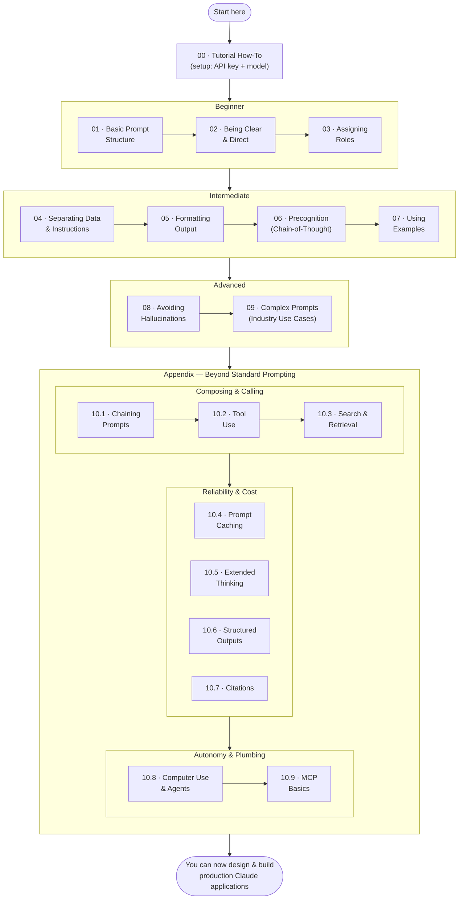
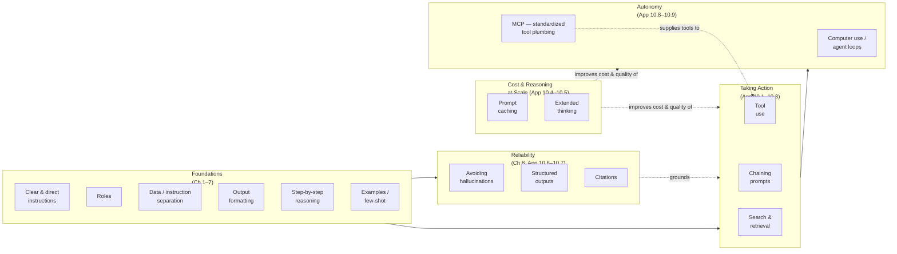

# Prompt Engineering Interactive Tutorial

A hands-on, notebook-based course for writing effective prompts and building production-ready applications on Claude — from your first prompt to prompt caching, extended thinking, tool use, and MCP-based agents.

> **About this fork:** the `Anthropic 1P/` track has been modernized for the current Claude model family (**Haiku 4.5 / Sonnet 5 / Opus 4.8**) and extended with six new appendix notebooks covering capabilities that didn't exist when this course was first written — prompt caching, extended thinking, structured outputs, citations, computer use/agents, and MCP. `AmazonBedrock/` is left as the original upstream content. This fork does not sync changes back to the original `anthropics/prompt-eng-interactive-tutorial` repo — see [Fork & Contribution Policy](#fork--contribution-policy).

**After completing this course, you'll be able to:**
- Write clear, well-structured prompts without hesitating on syntax
- Recognize common failure modes (hallucination, ambiguous instructions, format drift) and fix them with the right 80/20 technique
- Explain any concurrency-adjacent Claude concept — tool use, caching, reasoning, citations — in terms of what real problem it solves
- Build a genuine agentic application: tools, structured output, grounding, and the protocol (MCP) that wires it all together

---

## Contents
- [How to Use This Repo](#how-to-use-this-repo)
- [Project Structure](#project-structure)
- [Which Track Should I Use?](#which-track-should-i-use)
- [Learning Path](#learning-path)
- [How the Concepts Fit Together](#how-the-concepts-fit-together)
- [Notebook-by-Notebook Reference](#notebook-by-notebook-reference)
- [Model Notes](#model-notes)
- [Fork & Contribution Policy](#fork--contribution-policy)
- [License](#license)

---

## How to Use This Repo

### Prerequisites
- Python 3.9+
- Jupyter (`pip install notebook`, or open the `.ipynb` files in VS Code / JupyterLab)
- An [Anthropic API key](https://console.anthropic.com/) (for the `Anthropic 1P/` track), or AWS Bedrock model access (for the `AmazonBedrock/` track)

### Quick start — Anthropic 1P track (recommended)

```bash
git clone <your-fork-url>
cd "prompt-eng-interactive-tutorial/Anthropic 1P"
pip install anthropic
jupyter notebook
```

1. **Open `00_Tutorial_How-To.ipynb` first** and run every cell top to bottom. This sets your `API_KEY` and `MODEL_NAME` and stores them with IPython's `%store` magic, so every later notebook can pick them up with `%store -r` — you only enter your key once per kernel session.
2. **Work through `01` → `09` in order.** Each chapter builds on techniques from the last; skipping around will leave gaps.
3. **Then work through the appendix, `10.1` → `10.9`, in order.** These cover advanced, more "production system" techniques on top of the core course.
4. Every notebook has the same three sections:
   - **Lesson** — explanation plus runnable examples you execute as-is first, to see the behavior before you touch anything.
   - **Exercises** — you edit a `PROMPT` (or similar variable) and run a grading cell that tells you pass/fail immediately.
   - **Example Playground** — a no-stakes scratch area with the lesson's examples, free to break and experiment with.
5. **Stuck on an exercise?** Every exercise has a `❓ hint` cell that pulls a hint (and sometimes a full solution) from `hints.py`.

### Tips
- Run cells with `Shift+Enter`.
- If a later notebook complains it can't find `API_KEY` or `MODEL_NAME`, your kernel/session was reset — just rerun `00_Tutorial_How-To.ipynb` again.
- **Cost note:** the course defaults to **Claude Haiku 4.5** specifically so you can run every example and exercise cheaply and quickly. You can point `MODEL_NAME` at `claude-sonnet-5` or `claude-opus-4-8` at any time — every technique taught here transfers unchanged across the model family.
- There's also a [static answer key](https://docs.google.com/spreadsheets/d/1jIxjzUWG-6xBVIa2ay6yDpLyeuOh_hR_ZB75a47KX_E/edit?usp=sharing) and a [Google Sheets version](https://docs.google.com/spreadsheets/d/19jzLgRruG9kjUQNKtCg1ZjdD6l6weA6qRXG5zLIAhC8/edit?usp=sharing) of the original course, if you'd rather not run notebooks locally (note: the Sheets version reflects the original, non-modernized content).

---

## Project Structure

```
prompt-eng-interactive-tutorial/
├── Anthropic 1P/                        <- Direct Anthropic API track — start here, actively maintained
│   ├── 00_Tutorial_How-To.ipynb          <- Setup: API key, model name, your first call
│   ├── 01_Basic_Prompt_Structure.ipynb
│   ├── 02_Being_Clear_and_Direct.ipynb
│   ├── 03_Assigning_Roles_Role_Prompting.ipynb
│   ├── 04_Separating_Data_and_Instructions.ipynb
│   ├── 05_Formatting_Output_and_Speaking_for_Claude.ipynb
│   ├── 06_Precognition_Thinking_Step_by_Step.ipynb
│   ├── 07_Using_Examples_Few-Shot_Prompting.ipynb
│   ├── 08_Avoiding_Hallucinations.ipynb
│   ├── 09_Complex_Prompts_from_Scratch.ipynb
│   ├── 10.1_Appendix_Chaining Prompts.ipynb
│   ├── 10.2_Appendix_Tool Use.ipynb
│   ├── 10.3_Appendix_Search & Retrieval.ipynb
│   ├── 10.4_Appendix_Prompt Caching.ipynb        <- new
│   ├── 10.5_Appendix_Extended Thinking.ipynb      <- new
│   ├── 10.6_Appendix_Structured Outputs.ipynb     <- new
│   ├── 10.7_Appendix_Citations.ipynb              <- new
│   ├── 10.8_Appendix_Computer Use & Agents.ipynb  <- new
│   ├── 10.9_Appendix_MCP Basics.ipynb             <- new
│   └── hints.py                          <- Every exercise hint & solution, imported by the notebooks
│
├── AmazonBedrock/                        <- Same course, via AWS Bedrock — original content, not modernized here
│   ├── anthropic/                         <- Bedrock access using the `anthropic` SDK's Bedrock client
│   ├── boto3/                             <- Bedrock access using raw `boto3` bedrock-runtime calls
│   ├── cloudformation/                    <- CloudFormation template to stand up a Bedrock workshop environment
│   ├── utils/                             <- Shared helpers/hints for the Bedrock notebooks
│   ├── LICENSE                            <- MIT-No-Attribution (AWS sample code)
│   └── CONTRIBUTING.md
│
├── .gitignore
└── README.md                             <- you are here
```

---

## Which Track Should I Use?

| Track | Use if... | Status |
|---|---|---|
| **`Anthropic 1P/`** | You have (or can get) an Anthropic API key directly | ✅ **Current** — Haiku 4.5 / Sonnet 5 / Opus 4.8, all 19 notebooks |
| `AmazonBedrock/anthropic/` | You access Claude through AWS Bedrock and prefer the `anthropic` SDK's Bedrock client | Legacy — original Claude 3 Haiku/Sonnet content |
| `AmazonBedrock/boto3/` | You access Claude through AWS Bedrock and prefer raw `boto3` calls | Legacy — original Claude 3 Haiku/Sonnet content |

If you're not sure, use **`Anthropic 1P/`** — it's the track this fork actively maintains, and everything in the reference section below describes it.

---

## Learning Path



---

## How the Concepts Fit Together

The course teaches roughly five layers, each building on the ones before it. This is the mental model to hold onto as you go — a single well-written prompt (left) grows, layer by layer, into an agent (right):



**Read it as:** every technique after Chapter 7 exists to answer one question — *"my single prompt works, now how do I make this reliable, affordable, and able to actually take action at production scale?"* Reliability techniques stop it from being confidently wrong; caching and extended thinking make it cheap and capable enough to run at scale; tool use lets it act; autonomy techniques (computer use, MCP) let a whole loop of actions run with minimal supervision.

---

## Notebook-by-Notebook Reference

### Core Course

<details>
<summary><b>00 · Tutorial How-To</b> — one-time setup</summary>

Installs the `anthropic` SDK, sets `API_KEY` and `MODEL_NAME`, and introduces the `get_completion` helper pattern used throughout the course. Explains the current model family (Haiku 4.5 / Sonnet 5 / Opus 4.8) and why the course defaults to Haiku. Run this once per kernel session before anything else.
</details>

<details>
<summary><b>01 · Basic Prompt Structure</b> — Beginner</summary>

**Purpose:** the mechanics of the Messages API — `role`/`content` formatting, why turns must alternate starting with `user`, and what a system prompt is for.
**Why it matters:** almost every "the API rejected my request" bug at this level traces back to a malformed messages array. This is the one chapter where getting the plumbing right matters more than being clever.
</details>

<details>
<summary><b>02 · Being Clear and Direct</b> — Beginner</summary>

**Purpose:** Claude has no context beyond what you give it — treat it like a new hire on day one. Covers removing preambles, forcing a decisive answer instead of hedging, and just directly asking for what you want.
**Why it matters:** this is the single highest-leverage, lowest-effort prompting fix — most "bad" Claude output is actually an underspecified prompt.
</details>

<details>
<summary><b>03 · Assigning Roles (Role Prompting)</b> — Beginner</summary>

**Purpose:** priming Claude with a persona/role (via the system prompt) to shift tone, style, and sometimes correctness (e.g., "you are a meticulous logic bot" measurably improves logic-puzzle accuracy).
**Why it matters:** cheap, composable, and stacks with every other technique in the course.
</details>

<details>
<summary><b>04 · Separating Data and Instructions</b> — Intermediate</summary>

**Purpose:** building reusable prompt *templates* with variable substitution, and using XML tags so Claude never confuses user-supplied data for instructions.
**Why it matters:** this is the direct ancestor of prompt-injection defense — any app that inserts untrusted text into a prompt needs this. Points to **10.7 Citations** for the modern, structural way to ground answers in a real source document.
</details>

<details>
<summary><b>05 · Formatting Output and Speaking for Claude</b> — Intermediate</summary>

**Purpose:** XML-tagged output, prefilling the start of Claude's response to force a format, and using `stop_sequences` to cut generation short once you have what you need.
**Why it matters:** any pipeline that parses Claude's output programmatically depends on getting this right. Points to **10.6 Structured Outputs** for schema-guaranteed JSON instead of prefill-and-hope.
</details>

<details>
<summary><b>06 · Precognition (Thinking Step by Step)</b> — Intermediate</summary>

**Purpose:** manual chain-of-thought — asking Claude to reason in `<tags>` before answering, which can turn a wrong answer into a right one.
**Why it matters:** still the cheapest reliability lever in the book, and it works on every model. Points to **10.5 Extended Thinking** for the native, trained-in successor on hard multi-step problems.
</details>

<details>
<summary><b>07 · Using Examples (Few-Shot Prompting)</b> — Intermediate</summary>

**Purpose:** showing Claude 2-3 examples of ideal input/output pairs instead of describing the desired behavior in prose.
**Why it matters:** often the fastest way to nail a specific tone or exact output format — "show, don't tell."
</details>

<details>
<summary><b>08 · Avoiding Hallucinations</b> — Advanced</summary>

**Purpose:** giving Claude permission to say "I don't know," and the "extract quotes first, then answer" pattern for grounding answers in a long document.
**Why it matters:** the difference between a demo and something you'd trust in production. Points to **10.7 Citations** for the API-native version of "extract quotes first."
</details>

<details>
<summary><b>09 · Complex Prompts from Scratch</b> — Advanced</summary>

**Purpose:** combining everything into full, real-world system prompts — a career-coach chatbot, a legal-services assistant — plus exercises for financial services and coding assistants.
**Why it matters:** this is the "now build something real" checkpoint before the appendix. Closes with a pointer into the full appendix (10.1–10.9).
</details>

### Appendix — Beyond Standard Prompting

<details>
<summary><b>10.1 · Chaining Prompts</b></summary>

**Purpose:** multi-step pipelines — feed one Claude call's output into the next call's input (self-critique, revise, extract-then-transform).
**Why it matters:** the ancestor of every multi-turn agent loop in this course. Clarifies that manual "function calling" via chaining is obsolete — see 10.2 for the real mechanism — but chaining itself (draft → critique → revise) remains a core pattern.
</details>

<details>
<summary><b>10.2 · Tool Use</b> — rewritten for the current API</summary>

**Purpose:** the native `tools` / `tool_use` / `tool_result` mechanism — Claude requests a function call with schema-validated arguments, you run it, you feed the result back. Covers parallel tool calls and `tool_choice` (`auto` / `any` / `tool` / `none`).
**Why it matters:** this is the foundation everything from 10.4 onward builds on. *(This notebook previously taught a hand-rolled, pre-2024 XML function-calling format — it's been fully rewritten to the current API.)*
</details>

<details>
<summary><b>10.3 · Search & Retrieval</b></summary>

**Purpose:** grounding Claude in live or private information — the native `web_search` server tool for the open web, and RAG (vector retrieval + your own documents) for private data.
**Why it matters:** most "Claude doesn't know about X" problems are solved here, not by prompting harder.
</details>

<details>
<summary><b>10.4 · Prompt Caching</b> — new</summary>

**Purpose:** mark a large, reused prefix (a long system prompt, tool definitions, a reference document) with `cache_control` so repeat calls skip reprocessing it — cheaper and faster.
**Why it matters:** the single highest-leverage cost fix for any high-traffic or long-context agent; the "why did our bill 10x overnight" chapter.
</details>

<details>
<summary><b>10.5 · Extended Thinking</b> — new</summary>

**Purpose:** native reasoning mode (`thinking` parameter + token budget) — a trained-in scratchpad, distinct from manually prompted chain-of-thought (Ch 6).
**Why it matters:** meaningfully outperforms manual CoT on hard multi-step problems; also introduces interleaved thinking for reasoning between tool calls in an agent loop.
</details>

<details>
<summary><b>10.6 · Structured Outputs</b> — new</summary>

**Purpose:** force a tool call via `tool_choice` so Claude's `input` comes back as schema-guaranteed, already-parsed data — no `json.loads()` roulette.
**Why it matters:** eliminates an entire class of "the pipeline crashed on malformed JSON at 2am" production bugs.
</details>

<details>
<summary><b>10.7 · Citations</b> — new</summary>

**Purpose:** pass source material as a `document` content block with citations enabled, and get answers back with structured pointers to the exact passage each claim is grounded in.
**Why it matters:** turns "ask Claude to quote its sources" from a prompting trick into an API guarantee — critical for legal, financial, and support use cases.
</details>

<details>
<summary><b>10.8 · Computer Use & Agents</b> — new</summary>

**Purpose:** the conceptual leap from "tool use" to "agent" (a loop of observe → act → observe), and computer use specifically — a `computer` tool giving Claude screenshot-and-click/keyboard access to a real screen. Includes a dedicated safety section (sandboxing, prompt-injection risk from on-screen content, human confirmation on irreversible actions).
**Why it matters:** the highest-blast-radius category in the course — read the safety section before building one.
</details>

<details>
<summary><b>10.9 · MCP Basics</b> — new</summary>

**Purpose:** the Model Context Protocol — an open standard for supplying tools/data/prompts to an AI app, turning an M×N custom-integration problem into M+N. Includes a hands-on exercise adapting an MCP tool schema (`inputSchema`) into the Anthropic API's tool schema (`input_schema`).
**Why it matters:** this is what's actually running every `mcp__`-prefixed tool available in a Claude Code session — the capstone that ties tool use back to the infrastructure layer.
</details>

---

## Model Notes

As of this fork, the current Claude model family is:

| Model | Use for | Used by default in this course |
|---|---|---|
| **Claude Opus 4.8** | The hardest reasoning/agentic tasks | — |
| **Claude Sonnet 5** | The default choice for most production workloads | — |
| **Claude Haiku 4.5** | Fastest & cheapest, roughly last generation's mid-tier capability | ✅ Yes |

All three share the same API and the same prompting techniques — everything in this course transfers directly regardless of which model `MODEL_NAME` points to.

---

## Fork & Contribution Policy

This repository is a fork of [`anthropics/prompt-eng-interactive-tutorial`](https://github.com/anthropics/prompt-eng-interactive-tutorial), configured as follows:

- `origin` → this fork — all commits and pushes go here.
- `upstream` → the original Anthropic repo — fetch-only. Push access to `upstream` is intentionally disabled locally, so `git push upstream` fails safely instead of ever reaching the original repo.
- Changes here are **not** intended to be synced or PR'd back upstream — this fork exists to track independent modernization and enhancement, not to contribute back.

---

## License

The `AmazonBedrock/` sample code is licensed under [MIT-No-Attribution](AmazonBedrock/LICENSE) (Amazon.com, Inc.). The `Anthropic 1P/` course content originates from Anthropic's public interactive tutorial; no separate license file is included for that directory in this fork.
